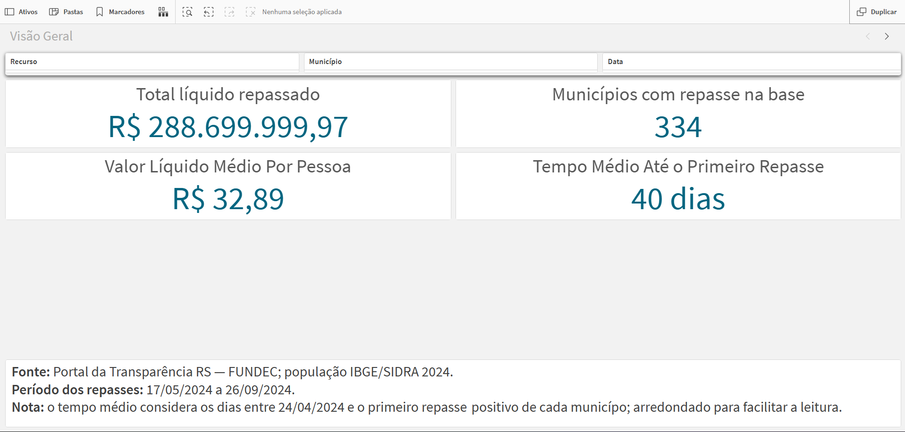
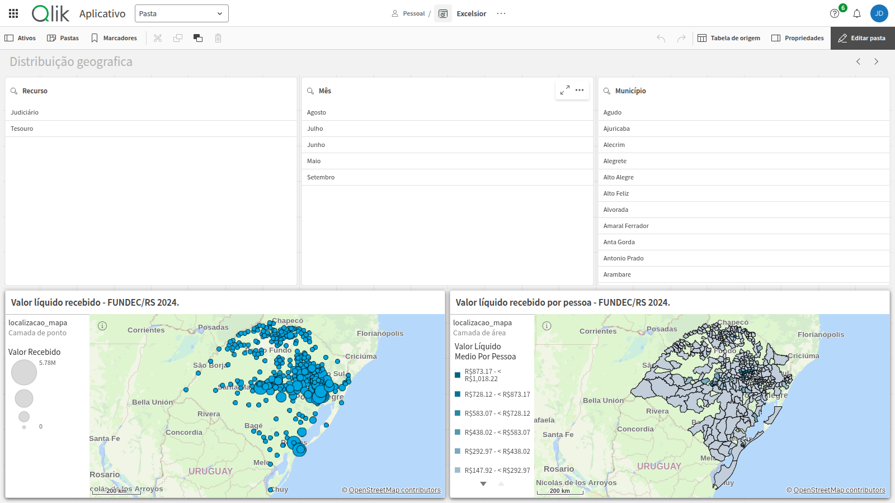
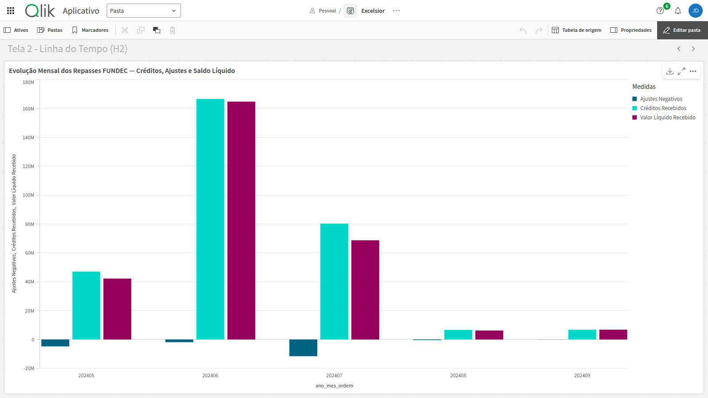
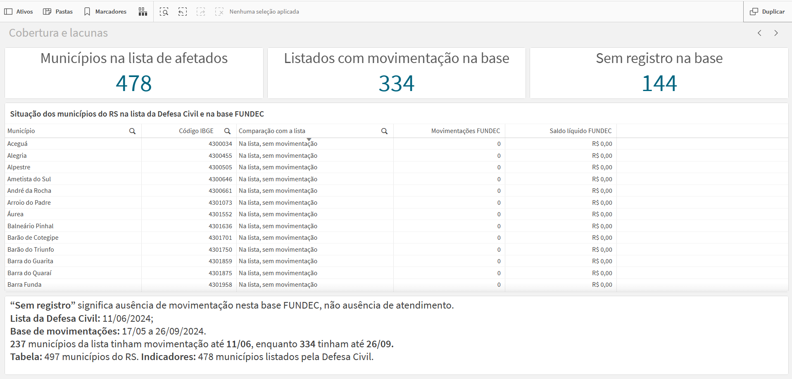
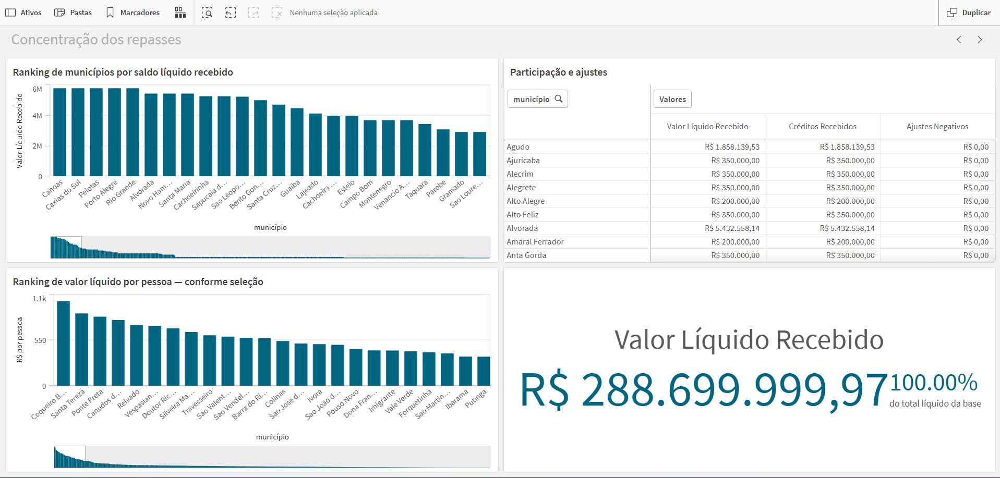
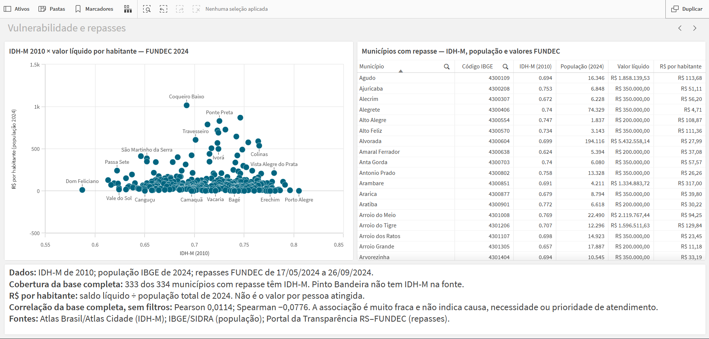

# Relatório descritivo — repasses do FUNDEC/RS após as enchentes de 2024

**Equipe:** Excelsior

**Integrantes:** Alan da Rosa Lorenz; John Victor do Espírito Santo da
Encarnação; Sallys Moraes Martins

**Período financeiro analisado:** 17/05/2024 a 26/09/2024

**Produto relacionado:** aplicativo Qlik Sense com as Telas 0 a 6

**Repositório do projeto:**
[github.com/Nalan27/Hackaton-Excelsior-](https://github.com/Nalan27/Hackaton-Excelsior-.git)

## Resumo executivo

Este relatório analisa a distribuição dos recursos do Fundo Estadual de Defesa
Civil do Rio Grande do Sul (FUNDEC) destinados a municípios relacionados às
enchentes de 2024. A análise combina movimentações financeiras detalhadas,
ranking oficial, população municipal, indicadores socioeconômicos e uma lista
oficial de municípios afetados. O aplicativo Qlik Sense apresenta os resultados
em visão geral, mapas, linha do tempo, cobertura, concentração, vulnerabilidade
e resumo executivo.

Na base detalhada, foram identificadas **658 movimentações** em **334
municípios**, entre maio e setembro de 2024. O saldo líquido é de
**R$ 288.699.999,97**, formado por **R$ 307.334.883,69 em créditos** e
**−R$ 18.634.883,72 em ajustes negativos**. A análise temporal mostra o maior
volume de créditos em junho e a maior concentração de ajustes em julho. Os 20
maiores municípios por saldo líquido representam 5,99% dos municípios com
movimentação e 34,03% do saldo líquido.

O cruzamento com a lista da Defesa Civil de 11/06/2024 encontrou 334 municípios
com movimentação na base completa e 144 municípios da lista sem movimentação
nesta fonte. Esse resultado indica uma lacuna de cobertura da base analisada,
mas **não comprova ausência de atendimento**, pois outros programas, fontes,
períodos e modalidades de apoio não estão necessariamente representados.

Na comparação entre IDH-M 2010 e valor líquido por pessoa, as correlações são
próximas de zero: **Pearson 0,0114** e **Spearman −0,0776**, em 333 municípios
comparáveis. O resultado não sustenta uma associação monotônica clara neste
recorte e não permite inferir causalidade, suficiência ou prioridade
administrativa.

O relatório é tecnicamente reproduzível e os cálculos críticos passaram em
**23 testes automatizados** no ambiente de desenvolvimento do projeto.

## 1. Contexto, problema e objetivo

As enchentes de 2024 produziram uma demanda extraordinária por reconstrução e
apoio aos municípios do Rio Grande do Sul. O FUNDEC é uma das fontes públicas
de transferência de recursos para ações de defesa civil. O desafio analítico é
permitir que gestores, pesquisadores, cidadãos e avaliadores respondam, com
clareza e rastreabilidade, às seguintes perguntas:

1. Qual foi o volume líquido de recursos movimentado e em que período?
2. Como os valores se distribuem geograficamente e por população municipal?
3. Como créditos, ajustes e saldo líquido evoluíram ao longo do tempo?
4. Quantos municípios da lista de afetados aparecem na base detalhada do
   FUNDEC?
5. Há concentração relevante dos repasses em poucos municípios?
6. Existe associação descritiva entre vulnerabilidade socioeconômica medida pelo
   IDH-M 2010 e valor líquido por habitante?

O objetivo não é julgar a legalidade, a suficiência ou a justiça de cada
repasse. A base disponível não contém, de forma completa e comparável, danos,
pessoas afetadas, solicitações, habilitações, decisões, pagamentos de outros
programas ou resultados da aplicação do recurso. As conclusões, portanto,
descrevem os registros observados e seus limites.

As hipóteses e telas usadas no produto são:

| Código | Pergunta analítica | Tela relacionada |
|---|---|---|
| H1 | Como os valores se distribuem no território e por pessoa? | Tela 1 — mapa |
| H2 | Como créditos, ajustes e saldo líquido evoluem no tempo? | Tela 2 — linha do tempo |
| H3 | Há associação descritiva entre IDH-M e R$/pessoa? | Tela 5 — vulnerabilidade |
| H4 | Quais municípios da lista de afetados não aparecem na base detalhada? | Tela 3 — cobertura |
| H5 | Quanto do saldo se concentra nos maiores municípios? | Tela 4 — concentração |

## 2. Bases utilizadas, anos e recortes

As bases brutas foram preservadas em `data/raw/`. As saídas tratadas estão em
`data/processed/` e alimentam o modelo analítico do Qlik.

| Base ou documento | Conteúdo e recorte | Ano/data de referência | Uso no relatório |
|---|---|---|---|
| `repasses_fundec_2024.csv` | 658 movimentações individualizadas, com data, município, recurso, processo e valor | 2024; 17/05–26/09 | Fonte operacional da tabela fato e dos KPIs |
| `ranking_oficial_fundec_2024.csv` | Ranking oficial de 334 municípios por valor pago | 2024 | Referência de conciliação, não denominador dos KPIs filtráveis |
| `populacao_rs_2024.csv` | População estimada dos 497 municípios do RS, IBGE/SIDRA, tabela 6579 | 2024 | Denominador do valor líquido por pessoa |
| `municipios-brasil.csv` | Cadastro municipal, código IBGE, IDH-M, população, PIB, área e densidade | IDH-M 2010; PIB 2023; demais campos conforme a coluna | Enriquecimento municipal; o teste de vulnerabilidade usa IDH-M 2010 |
| `defesa-civil-rs-municipios-afetados-2024-06-11.pdf` | Extrato nominal com 478 municípios afetados | Extrato de 11/06/2024 às 10:06 | Comparação de cobertura; não define elegibilidade ao FUNDEC |
| Decreto Estadual RS nº 57.604/2024 | Marco documental do período estadual dos eventos climáticos | 2024; marco adotado em 24/04/2024 | Referência do cálculo de intervalo até o primeiro crédito |
| Lei Complementar nº 16.263/2024 e demais PDFs legais | Contexto institucional e normativo da defesa civil | 2023–2025 conforme o documento | Contextualização; não entram como linhas financeiras |

Também existem arquivos auxiliares de recursos recebidos e convênios. Eles
foram inventariados, mas não foram incorporados aos indicadores finais porque
sua relação, granularidade e correspondência com o escopo FUNDEC/RS não foram
validadas como equivalentes às movimentações detalhadas.

As fontes públicas utilizadas incluem o Portal da Transparência do Rio Grande
do Sul, o IBGE/SIDRA, a Defesa Civil do Estado e a legislação estadual citada
na tabela acima.

## 3. Metodologia executada

### 3.1 Preparação e perfilamento

1. Os arquivos brutos foram mantidos sem alteração.
2. O ETL converteu datas para `YYYY-MM-DD`, valores monetários para números
   decimais e identificadores como processo, empenho, CNPJ e código IBGE para
   texto.
3. Os nomes municipais foram normalizados apenas para a conciliação nominal;
   a chave analítica final é o código IBGE de sete dígitos.
4. Foram verificadas duplicidades, nulos, datas inválidas, chaves órfãs,
   população ausente e localizações duplicadas.
5. Foi construído um modelo em estrela com `fato_repasses`, `dim_municipio`,
   `dim_calendario`, `intervalo_primeiro_repasse` e, para a análise de
   cobertura, `cobertura_municipal`.

O calendário tem 133 datas diárias, de 17/05/2024 a 26/09/2024, sem lacunas e
associadas à tabela fato pela data.

### 3.2 Tratamento dos valores negativos

Os 18 lançamentos negativos foram preservados na tabela fato e documentados
durante o processamento. Eles são tratados como ajustes ou estornos, sem
aplicação de valor absoluto.

As regras são:

- **Créditos:** soma de `valor > 0`.
- **Ajustes negativos:** soma de `valor < 0`, mantendo o sinal.
- **Saldo líquido:** soma de todos os valores assinados.
- **Primeiro repasse elegível:** menor data com valor positivo e data válida.
  Um estorno não inicia atendimento, mas permanece no saldo e nas demais
  análises.
- **Valor por pessoa:** saldo líquido agregado dividido pela população agregada
  uma única vez por município.

Com isso, a identidade de controle é:

```text
créditos + ajustes negativos = saldo líquido
R$ 307.334.883,69 − R$ 18.634.883,72 = R$ 288.699.999,97
```

### 3.3 Métricas e critérios comparativos

| Métrica | Regra executada | Critério de comparação |
|---|---|---|
| Total líquido | `Sum(valor)` | Toda a seleção financeira da base detalhada |
| Municípios atendidos | Municípios distintos com movimentação | 334 municípios; não confundir com os 497 do cadastro estadual |
| R$/pessoa | Saldo líquido / população IBGE/SIDRA 2024 | Razão entre totais agregados, não soma de razões municipais |
| Espera média | Média dos intervalos válidos entre 24/04/2024 e primeiro crédito positivo | 334 municípios; marco comum e documental, não data do impacto local |
| Concentração | Soma dos maiores saldos líquidos / saldo líquido total | Cortes de 5, 10 e 20 municípios |
| Vulnerabilidade | Correlação de Pearson e Spearman entre IDH-M 2010 e R$/pessoa | 333 municípios com as duas medidas; quartis observados do IDH-M |
| Cobertura | Cruzamento por código IBGE entre lista de afetados e fato | Lista de 11/06/2024 versus base financeira até 26/09/2024; também recorte até 11/06 |

### 3.4 Conciliação

O total da tabela fato foi comparado com o ranking oficial. A diferença não foi
compensada nem ocultada:

| Fonte | Total |
|---|---:|
| Movimentações detalhadas | R$ 288.699.999,97 |
| Ranking oficial | R$ 289.176.004,25 |
| Detalhada menos ranking | **−R$ 476.004,28** |

A diferença está concentrada em três municípios:

| Município | Diferença fato menos ranking |
|---|---:|
| São Sebastião do Caí | −R$ 200.000,00 |
| Canoas | −R$ 176.004,28 |
| Harmonia | −R$ 100.000,00 |

A base detalhada foi escolhida como fonte operacional porque permite analisar
as 658 movimentações individualizadas e responder corretamente a filtros por
data, município e recurso. O ranking permanece como controle independente.

### 3.5 Validação do cálculo e do aplicativo

Foram executados os três componentes principais do pipeline: preparação da
base financeira, cobertura municipal e análise de IDH-M por valor por pessoa.
A suíte automatizada passou com **23 de 23 testes**. Os testes cobrem, entre
outros pontos, tipos e chaves, calendário, valores negativos, conciliação,
cálculo per capita, primeiro crédito elegível, cobertura e integridade do
modelo. As Telas 0 a 6 também foram percorridas com filtros e casos de controle
para conferir a resposta visual do aplicativo.

## 4. Achados

### 4.1 Visão geral dos repasses

| Indicador sem filtros | Resultado |
|---|---:|
| Movimentações | 658 |
| Municípios com movimentação | 334 |
| Créditos positivos | R$ 307.334.883,69 |
| Ajustes negativos | −R$ 18.634.883,72 |
| Saldo líquido | **R$ 288.699.999,97** |
| Saldo líquido médio por pessoa | R$ 32,89 |
| Intervalo médio até o primeiro crédito | 40,13 dias |
| Mediana do intervalo até o primeiro crédito | 28 dias |
| Faixa observada do intervalo | 23 a 135 dias |

O número médio por pessoa é uma normalização pela população municipal total.
Não representa o repasse por pessoa afetada.

### 4.2 Evolução temporal

| Mês | Créditos | Ajustes negativos | Saldo líquido |
|---|---:|---:|---:|
| 2024-05 | R$ 47.000.000,00 | −R$ 4.800.000,00 | R$ 42.200.000,00 |
| 2024-06 | R$ 166.625.581,37 | −R$ 1.869.767,44 | **R$ 164.755.813,93** |
| 2024-07 | R$ 80.289.534,88 | **−R$ 11.565.116,28** | R$ 68.724.418,60 |
| 2024-08 | R$ 6.617.441,86 | −R$ 400.000,00 | R$ 6.217.441,86 |
| 2024-09 | R$ 6.802.325,58 | R$ 0,00 | R$ 6.802.325,58 |
| **Total** | **R$ 307.334.883,69** | **−R$ 18.634.883,72** | **R$ 288.699.999,97** |

Junho concentra o maior volume de créditos e o maior saldo líquido mensal.
Julho concentra aproximadamente **62%** de todos os ajustes negativos do
período. A base confirma a magnitude, mas não explica a causa desse ajuste.

### 4.3 Distribuição geográfica e comparação por pessoa

O mapa cobre os 334 municípios com movimentação, não os 497 municípios do RS
nem todos os municípios afetados. A Tela 1 apresenta simultaneamente valor
líquido e valor líquido por pessoa, com filtros por recurso, mês e município.

Porto Alegre é um caso importante para interpretar os sinais: teve
**R$ 16.247.674,42 em créditos**, **−R$ 10.465.116,28 em ajustes**, saldo
líquido de **R$ 5.782.558,14** e **R$ 4,16 por pessoa**. A leitura de créditos
brutos sem os ajustes produziria uma conclusão diferente da leitura do saldo
líquido.

### 4.4 Cobertura da lista de municípios afetados

| Controle | Resultado |
|---|---:|
| Municípios do RS no cadastro IBGE | 497 |
| Municípios no extrato da Defesa Civil de 11/06/2024 | 478 |
| Municípios da lista com movimentação até 26/09/2024 | 334 |
| Municípios da lista sem movimentação nessa base | 144 |
| Municípios da lista com movimentação até 11/06/2024 | 237 |
| Municípios fora da lista com movimentação | 0 |
| Municípios fora da lista sem movimentação | 19 |

Todos os 334 municípios com movimentação no período completo estão na lista
de afetados. Os 144 casos são registros para investigação da cobertura da base
detalhada, não uma afirmação de que os municípios não receberam assistência.
Entre a data do extrato e o fim da base financeira, 97 municípios adicionais
passaram a ter movimentação registrada.

### 4.5 Concentração dos maiores municípios

| Corte por saldo líquido | Saldo líquido | Participação no total |
|---|---:|---:|
| 5 maiores | R$ 28.912.790,70 | 10,01% |
| 10 maiores | R$ 55.729.069,78 | 19,30% |
| 20 maiores | R$ 98.238.372,09 | **34,03%** |

Os 20 maiores são **20 de 334 municípios**, ou **5,99%** do universo com
movimentação. O grupo recebeu R$ 110.603.488,37 em créditos e sofreu
−R$ 12.365.116,28 em ajustes, resultando em R$ 98.238.372,09 líquidos. O
resultado indica concentração relevante, mas não maioria dos recursos.

Os 20 maiores por valor líquido não são o mesmo ranking dos 20 maiores por
R$/pessoa. A comparação por pessoa deve ser apresentada separadamente, porque
municípios pequenos podem apresentar valores altos por habitante com valores
absolutos menores.

### 4.6 IDH-M e valor líquido por pessoa

Dos 334 municípios com movimentação, 333 possuem IDH-M 2010 na fonte
compilada. **Pinto Bandeira**, código IBGE `4314548`, permanece sem imputação e
fica fora das correlações.

| Teste | Resultado |
|---|---:|
| Pearson, IDH-M 2010 × R$/pessoa | 0,0114 |
| Spearman, IDH-M 2010 × R$/pessoa | −0,0776 |
| Municípios comparáveis | 333 |
| Municípios com população abaixo de 5.000 | 150 de 333 |
| Pearson com população ≥ 5.000 | −0,1044 |
| Spearman com população ≥ 5.000 | −0,1227 |

Os quartis observados do IDH-M foram 0,683, 0,718 e 0,746. As medianas de
R$/pessoa foram R$ 69,95 no Q1, R$ 56,53 no Q2, R$ 77,67 no Q3 e R$ 57,96 no
Q4. Não surge uma relação monotônica clara neste recorte. O IDH-M é de 2010 e
não mede diretamente a vulnerabilidade das enchentes de 2024.

### 4.7 Capturas do dashboard e explicação dos gráficos

As capturas abaixo foram feitas na versão final do aplicativo Qlik Sense e
apresentam as sete telas utilizadas na análise.

**Tela 0 — visão geral e KPIs.** Os cartões mostram o saldo líquido total
(R$ 288.699.999,97), os 334 municípios com movimentação, o saldo por pessoa
(R$ 32,89) e o intervalo médio até o primeiro crédito. O aplicativo exibe a
espera arredondada para 40 dias; o cálculo sem arredondamento é 40,13 dias.
Os filtros de recurso, município e data permitem examinar subconjuntos.



**Tela 1 — dois mapas municipais.** O mapa de pontos varia o tamanho dos
marcadores segundo o valor líquido recebido. O mapa de áreas mostra o saldo
líquido por pessoa, usando a população municipal estimada em 2024 como
denominador. Os mapas permitem comparar valor absoluto e valor por habitante,
mas cobrem apenas municípios com movimentação nesta base.



**Tela 2 — linha do tempo.** As barras mensais separam créditos positivos,
ajustes negativos e saldo líquido de maio a setembro de 2024. Junho tem o
maior volume de créditos e o maior saldo; julho concentra o maior ajuste
negativo. A altura das barras descreve os registros, sem explicar a causa
administrativa de cada ajuste.



**Tela 3 — cobertura da lista de afetados.** Os KPIs mostram 478 municípios
no extrato da Defesa Civil, 334 com movimentação e 144 sem movimentação nesta
base até 26/09/2024. A tabela permite verificar município, código IBGE,
situação na lista, quantidade de movimentos e saldo. “Sem registro” não
significa ausência de assistência por outros meios.



**Tela 4 — concentração.** O gráfico superior ordena os 20 maiores saldos
líquidos municipais. O gráfico inferior ordena os 20 maiores valores por
pessoa; os grupos não são necessariamente os mesmos. A tabela discrimina
saldo, créditos e ajustes por município, e o cartão apresenta o total
líquido do recorte. Na base completa, os 20 maiores por saldo concentram
34,03% do total, conforme o cálculo da seção 4.5.



**Tela 5 — IDH-M e repasse por pessoa.** Cada ponto do gráfico de dispersão
representa um município com IDH-M 2010 e saldo por habitante calculado com
população de 2024. A tabela explicita os dados municipais usados na
comparação. Entre os 333 municípios comparáveis, as correlações sem filtros
são próximas de zero; o gráfico não demonstra causalidade nem prioridade
administrativa.



**Tela 6 — resumo dos achados.** Os cartões retomam saldo líquido, saldo por
pessoa e ajuste negativo de julho. O gráfico de dispersão resume a comparação
com IDH-M. Os blocos de texto associam cada resultado a uma recomendação e a
seu limite de interpretação; os valores desta tela representam a visão sem
filtros do relatório.


## 5. Conclusões

1. A base detalhada registra R$ 288,7 milhões líquidos em 658 movimentações e
   334 municípios. O saldo líquido é a medida mais adequada para o painel
   porque preserva créditos e ajustes.
2. Os pagamentos foram temporalmente concentrados entre maio e setembro, com
   pico de créditos e saldo em junho. O grande ajuste negativo de julho requer
   consulta à documentação administrativa antes de uma interpretação
   definitiva sobre sua causa.
3. Há concentração: 20 municípios, 5,99% do universo atendido na base,
   concentram 34,03% do saldo líquido. Isso descreve distribuição, mas não
   estabelece excesso, insuficiência ou injustiça.
4. A comparação da lista da Defesa Civil com a base financeira identifica 144
   municípios afetados sem movimentação registrada na fonte analisada até
   26/09. A evidência é uma lacuna de cobertura da base, não prova de ausência
   de assistência.
5. A associação entre IDH-M 2010 e R$/pessoa é próxima de zero. Não há base
   para afirmar que o padrão observado foi direcionado pelo IDH-M, tampouco
   para afirmar o contrário sobre critérios de decisão não observados.
6. A conciliação financeira identifica uma diferença de R$ 476.004,28 entre
   a tabela detalhada e o ranking oficial. A divergência foi mantida explícita,
   e o aplicativo usa o total da base detalhada.

## 6. Recomendações para a gestão pública

1. **Documentar o ajuste de julho.** Identificar os processos e atos que
   explicam os R$ 11,565 milhões negativos do mês, preservando a distinção
   entre estorno, correção e nova transferência.
2. **Revisar a conciliação com o ranking oficial.** Conferir São Sebastião do
   Caí, Canoas e Harmonia contra a versão de origem e registrar se a diferença
   decorre de período, versão, filtro ou ajuste.
3. **Manter duas leituras de valor:** saldo líquido e créditos brutos, sempre
   com ajustes negativos explícitos. Não substituir valores negativos por zero
   ou `Abs()`.
4. **Publicar valor absoluto e per capita juntos.** Exibir população, período,
   universo e denominador em cada tela. Destacar que R$/pessoa usa a população
   total, não pessoas afetadas.
5. **Investigar os 144 casos de cobertura.** Cruzar cada município com outros
   programas de apoio, publicações municipais e versões históricas dos painéis
   antes de qualquer afirmação sobre ausência de atendimento.
6. **Adicionar dados de necessidade.** Para uma análise de equidade, incorporar
   pessoas afetadas, danos, perdas, população atingida e datas de solicitação,
   habilitação, empenho, liquidação e pagamento, com fontes e anos explícitos.
7. **Automatizar controles de atualização.** Fazer o ETL falhar ou emitir
   alerta quando houver chaves órfãs, indicadores ausentes, divergência de
   conciliação acima da tolerância ou mudança no número de registros.
8. **Versionar o ciclo de publicação.** Manter o hash do aplicativo, as bases
   usadas, a data da recarga, a data da última atualização e a evidência de
   conferência. Atualizar os materiais publicados sempre que o aplicativo ou
   seus dados mudarem.

## 7. Limitações, vieses e critérios de interpretação

- A base financeira cobre 17/05–26/09/2024 e pode não conter todos os
  programas, transferências ou formas de atendimento.
- A lista da Defesa Civil é um extrato de 11/06/2024. A diferença de datas
  impede tratar a comparação como uma fotografia única do atendimento.
- A presença na lista de afetados não define elegibilidade ao FUNDEC, e a
  ausência na base não prova ausência de ajuda.
- O mapa representa municípios com movimentação, não o universo de municípios
  afetados.
- O denominador per capita é a população estimada de 2024. Ele não é uma
  contagem de pessoas atingidas e pode produzir valores altos em municípios
  pequenos.
- O IDH-M 2010 é histórico em relação ao evento de 2024. Um coeficiente de
  correlação não demonstra causalidade, prioridade, suficiência ou equidade.
- Um município sem IDH-M não recebeu valor imputado. A ausência permanece
  explícita como dado faltante.
- O ranking oficial e a tabela detalhada não conciliam integralmente. Os dois
  artefatos devem continuar disponíveis para auditoria.

## 8. Declaração de uso de inteligência artificial

Foi utilizado o **OpenAI Codex**, agente de IA baseado em GPT-5, para:

- auxiliar na inspeção das bases, dos scripts, dos testes e das evidências;
- apoiar a execução dos scripts e da suíte de testes;
- recalcular e conferir os números apresentados neste relatório;
- organizar a redação, as tabelas, as limitações e as recomendações;
- revisar a consistência entre as bases processadas e as evidências do
  aplicativo.

O Codex não criou os registros financeiros, não substituiu os arquivos brutos,
não imputou o IDH-M ausente e não definiu os critérios analíticos do projeto.
Os números do relatório foram obtidos das fontes e bases processadas ou
reproduzidos pelos scripts do projeto.

### Supervisão humana

A equipe definiu o problema, selecionou as fontes, estabeleceu as métricas e
interpretou os resultados. Também conferiu os indicadores críticos com as
bases processadas, percorreu as Telas 0 a 6, testou filtros e casos de controle
e revisou as conclusões para evitar inferências causais ou acusações não
sustentadas pelos dados. A inteligência artificial foi utilizada como apoio e
não como substituta da decisão metodológica e da responsabilidade da equipe.
