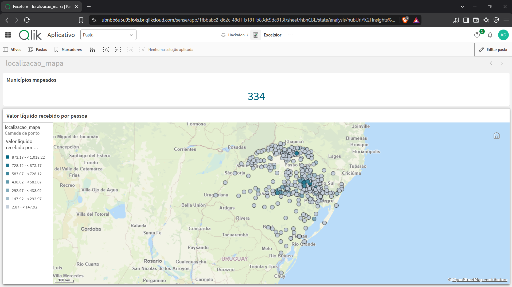

# Task 11 — mapa de teste

## Objetivo

Construir no Qlik Sense um protótipo com uma bolha por município recebedor do
FUNDEC/RS e colorir as bolhas pelo valor líquido recebido por pessoa. O mapa é
um teste de distribuição espacial e não representa, nesta etapa, os limites
territoriais dos municípios.

## Cobertura e identificação geográfica

- Universo estadual da fonte populacional: 497 municípios do Rio Grande do Sul.
- Universo exibido: 334 municípios presentes no ranking de repasses.
- Cobertura populacional entre os recebedores: 334/334 (100%).
- Identificador de junção: código IBGE de sete dígitos (`chave_municipal`).
- Localização entregue ao geocodificador do Qlik:
  `municipio_ibge_2024, Rio Grande do Sul, Brasil`.
- Validações automáticas: nenhum código IBGE duplicado, nenhuma população
  ausente ou não positiva e nenhuma localização textual duplicada.

O nome oficial com UF e país reduz a ambiguidade entre cidades homônimas. A
posição final ainda depende do geocodificador do Qlik e deve ser conferida
visualmente antes de encerrar a task.

## Denominador e cálculo

A população usada é a estimativa municipal de 2024 do IBGE, exportada da
[Tabela SIDRA 6579](https://sidra.ibge.gov.br/tabela/6579). O ano coincide com
o período dos repasses e a unidade da fonte é pessoas.

O indicador preparado no ETL é:

```text
valor_por_pessoa_2024 = total_repasses / populacao_2024
```

`total_repasses` é a soma líquida da tabela fato: créditos positivos e 18
estornos/ajustes negativos são preservados. Portanto, o indicador não é o
valor bruto concedido nem uma medida de necessidade, dano ou efetividade.

Para o mapa responder aos filtros da tabela fato, use no Qlik a expressão
dinâmica equivalente:

```qlik
Sum(valor) / Only(populacao_2024)
```

Formate a medida como moeda, com duas casas decimais, e nomeie-a **Valor
líquido recebido por pessoa (população IBGE 2024)**.

## Construção no Qlik Sense

1. Substitua `dim_municipio.csv` no espaço de dados pelo arquivo atualizado de
   `data/processed/`.
2. No **Editor de carga de dados**, atualize o bloco `dim_municipio` com o
   conteúdo de `qlik/load_data.qvs` e clique em **Carregar dados**.
3. Em uma nova pasta chamada **Mapa de teste**, clique em **Editar pasta**.
4. Em **Gráficos**, arraste **Mapa** para a pasta.
5. No painel de propriedades, abra **Camadas**, clique em **Adicionar camada**
   e escolha **Camada de ponto**.
6. Em **Dimensões**, adicione `municipio_ibge_2024`.
7. Em **Localização**, desative o uso automático da dimensão como localização
   se essa opção aparecer e selecione `localizacao_mapa` como campo de
   localização.
8. Em **Cores e legenda**, escolha **Por medida**, crie a expressão
   `Sum(valor) / Only(populacao_2024)` e use uma escala sequencial.
9. Mantenha o tamanho das bolhas fixo no protótipo. Assim, tamanho e cor não
   codificam duas vezes a mesma medida.
10. Dê ao gráfico o título **Valor líquido recebido por pessoa — FUNDEC/RS
    2024**.

A documentação do Qlik confirma que camadas de ponto aceitam localidades como
dimensão e permitem colorir os pontos por medida. Se houver posicionamentos
incorretos, as opções de **Localização** devem ser usadas para restringir o
escopo geográfico.

## Conferência manual mínima

Confira no mapa e no tooltip pelo menos estes casos:

| Município | Código IBGE | População 2024 | Total líquido | R$/pessoa esperado |
|---|---:|---:|---:|---:|
| Porto Alegre | 4314902 | 1.389.322 | R$ 5.782.558,14 | R$ 4,16 |
| Canoas | 4304606 | 359.554 | R$ 5.782.558,14 | R$ 16,08 |
| Santa Maria | 4316907 | 282.244 | R$ 5.432.558,14 | R$ 19,25 |
| Bagé | 4301602 | 121.900 | R$ 350.000,00 | R$ 2,87 |
| Coqueiro Baixo | 4305835 | 1.311 | R$ 1.334.883,72 | R$ 1.018,22 |

Além dos valores, confirme que todos os cinco pontos aparecem dentro do Rio
Grande do Sul. O contraste entre Bagé e Coqueiro Baixo é útil para verificar
se a cor realmente representa valor por pessoa, e não valor total.

## Evidências de conclusão

- o mapa exibe 334 municípios e a legenda do valor líquido por pessoa;
- a inspeção visual não encontrou pontos fora do Rio Grande do Sul;
- a amostra numérica acima foi conferida contra a saída reproduzível do ETL;
- a associação por código IBGE, a cobertura populacional e a unicidade das
  localizações são verificadas pelos testes automatizados;
- o snapshot QVF com dados está em
  `qlik/versoes-do-app/03-task-11/app.qvf`.



## Ajustes para reutilização na task 14

- trocar a bolha por polígonos municipais oficiais ou pontos com coordenadas
  versionadas, eliminando a dependência do geocodificador textual;
- definir classes, paleta acessível e tratamento visual de valores extremos;
- incluir tooltip com total líquido, população, valor por pessoa e código IBGE;
- explicar que o mapa cobre recebedores, não todos os municípios atingidos;
- testar filtros, zoom, sobreposição de bolhas e legibilidade em telas menores;
- manter explícitos o ano da população e o tratamento dos estornos.

## Estado da validação

Concluída em 13/09/2026. O ETL passou em 17 testes automatizados, a captura
registra o KPI de 334 municípios e o QVF foi exportado com dados. O mapa é um
protótipo por pontos; os aprimoramentos necessários para a versão final estão
registrados acima para a task 14.
