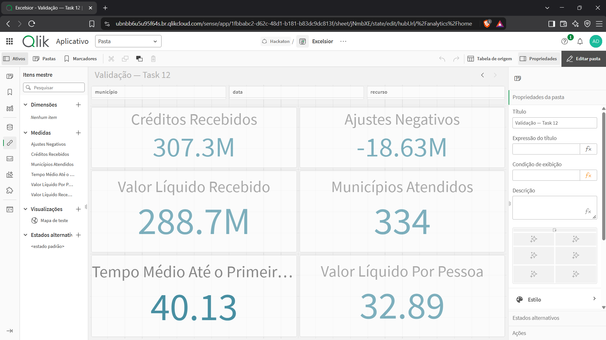
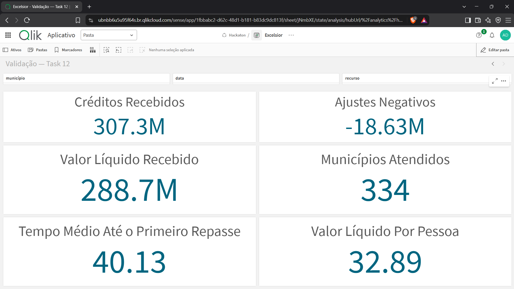
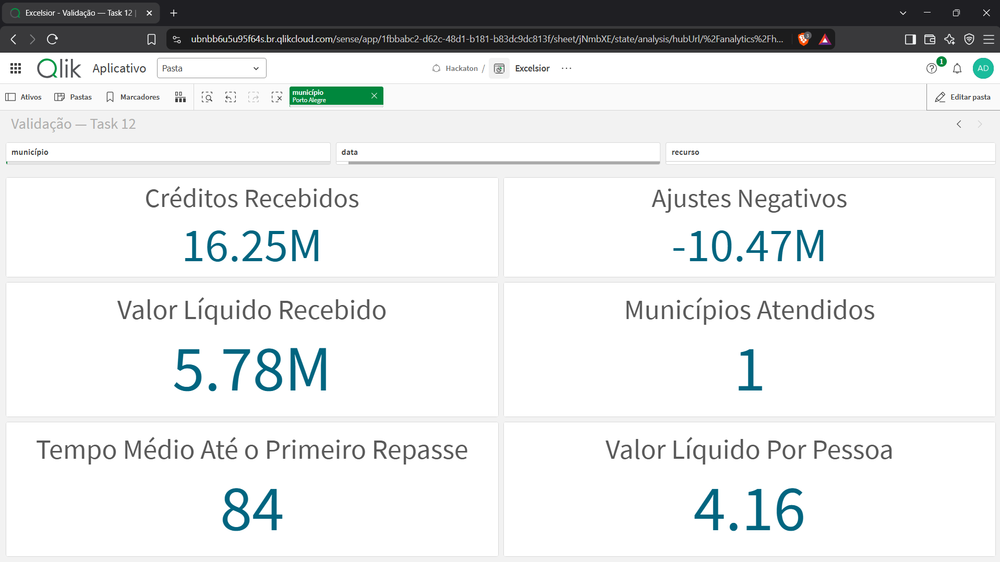
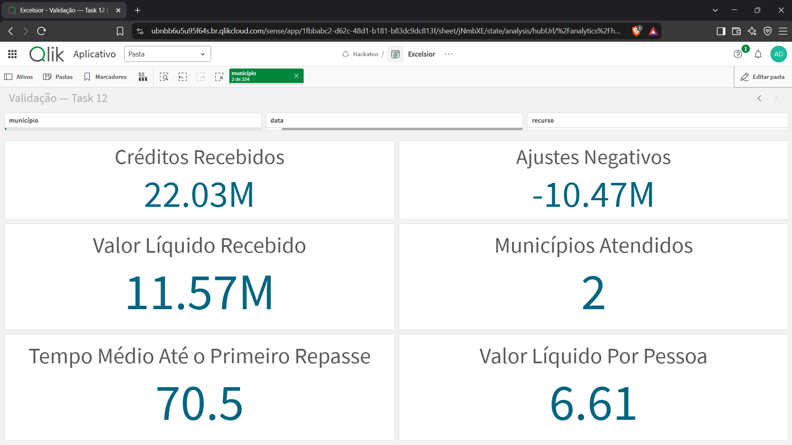
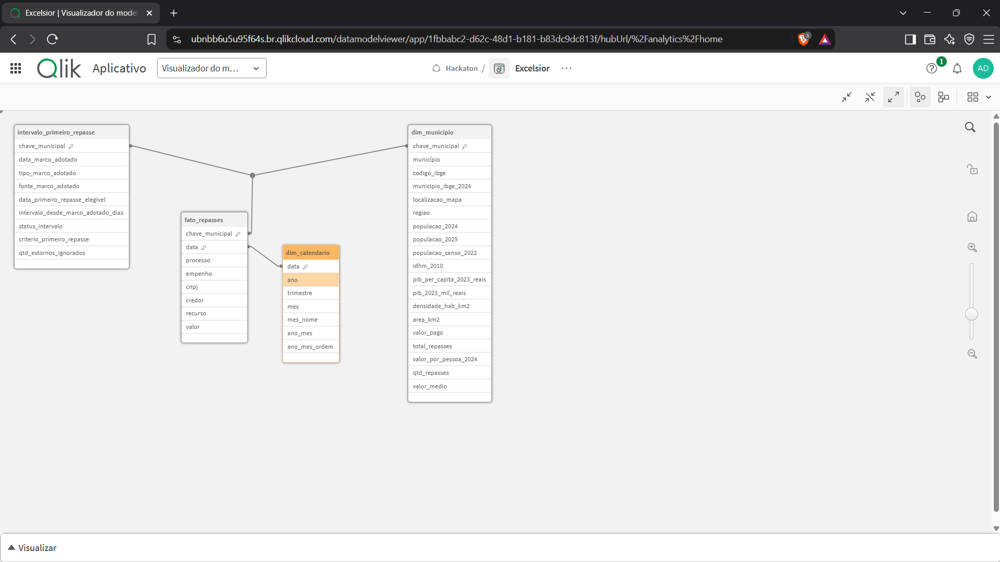

# Task 12 — cálculos reutilizáveis

## Objetivo

Padronizar no Qlik Sense as medidas usadas em todo o aplicativo, garantir que
elas respondam corretamente aos filtros e registrar evidências de que o modelo
não possui tabelas isoladas, chaves sintéticas ou associações circulares.

O catálogo normativo das expressões está em
[`qlik/medidas-mestras.md`](../qlik/medidas-mestras.md).

## Medidas definidas

| Medida | Regra resumida | Resultado sem filtros |
|---|---|---:|
| Valor líquido recebido | Créditos e ajustes com sinal | R$ 288.699.999,97 |
| Créditos recebidos | Somente `valor > 0` | R$ 307.334.883,69 |
| Ajustes negativos | Somente `valor < 0`, preservando o sinal | R$ -18.634.883,72 |
| Municípios atendidos | Chaves municipais distintas | 334 |
| Valor líquido por pessoa | Total líquido / população única dos municípios | R$ 32,89 |
| Tempo médio até o primeiro repasse | Média dos intervalos municipais válidos | 40,13 dias |

Os cálculos de valor partem de `fato_repasses.valor`, evitando o uso de totais
pré-calculados que não responderiam adequadamente aos filtros de data ou
recurso. O denominador per capita agrega uma população por município antes da
divisão e não soma razões municipais.

## Conciliação

A base detalhada totaliza R$ 288.699.999,97 e o ranking oficial totaliza
R$ 289.176.004,25. A diferença de R$ -476.004,28 está registrada em
`data/processed/conciliacao.csv` e concentrada em três municípios:

| Município | Diferença entre fato e ranking |
|---|---:|
| São Sebastião do Caí | R$ -200.000,00 |
| Canoas | R$ -176.004,28 |
| Harmonia | R$ -100.000,00 |

A base detalhada é a fonte operacional das medidas porque contém as 658
movimentações individualizadas, incluindo 18 ajustes negativos. O ranking é
mantido como referência de conciliação. A diferença é explicitada, não
compensada ou ocultada.

## Validações automatizadas

`tests/test_etl_outputs.py` confere:

- créditos, ajustes negativos e valor líquido globais;
- identidade entre créditos, ajustes e total líquido;
- quantidade de municípios atendidos;
- população agregada e valor líquido por pessoa;
- tempo médio municipal;
- seleção conjunta de Porto Alegre e Canoas, comprovando a divisão dos totais
  agregados;
- preservação dos 18 valores negativos;
- três divergências da conciliação;
- integridade das associações previstas no modelo.

Execução:

```powershell
.\.venv\Scripts\python.exe etl\analis_de_dados.py
.\.venv\Scripts\python.exe -m unittest discover -s tests -v
```

## Validação no Qlik Cloud

A validação foi concluída em 15/09/2026. Foram criados seis itens mestres e
uma pasta `Validação — Task 12` com os respectivos KPIs e filtros de município,
data e recurso.

As seguintes conferências foram aprovadas:

- sem filtros: R$ 307,33 milhões em créditos, R$ -18,63 milhões em ajustes,
  R$ 288,70 milhões líquidos, 334 municípios, R$ 32,89 por pessoa e média de
  40,13 dias;
- Porto Alegre: R$ 16,25 milhões em créditos, R$ -10,47 milhões em ajustes,
  R$ 5,78 milhões líquidos, R$ 4,16 por pessoa e 84 dias;
- Porto Alegre e Canoas: R$ 11,57 milhões líquidos, dois municípios, R$ 6,61
  por pessoa e média de 70,5 dias;
- recurso Judiciário: R$ 192,03 milhões em créditos, R$ -12,03 milhões em
  ajustes, R$ 180 milhões líquidos, 95 municípios, R$ 30,93 por pessoa e
  média de 36,71 dias;
- data 22/05/2024: R$ 19,8 milhões líquidos, nenhum ajuste, 92 municípios,
  R$ 8,65 por pessoa e média de 27,98 dias.

Durante a revisão foi identificada uma carga antiga duplicada de
`dim_municipio`. O bloco antigo foi removido da seção `Main` e os campos da
dimensão atual foram normalizados após a seção gerada automaticamente. A
recarga final preservou os resultados das medidas e deixou somente as quatro
tabelas analíticas esperadas.

O modelo esperado é:

```text
dim_municipio (chave_municipal)
├── fato_repasses (chave_municipal) ── data ── dim_calendario
└── intervalo_primeiro_repasse (chave_municipal)
```

Somente `dim_municipio.csv`, `fato_repasses.csv`, `dim_calendario.csv` e
`intervalo_primeiro_repasse.csv` devem formar o modelo analítico. Arquivos de
validação, conciliação ou documentação não devem ser carregados como tabelas.











## Evidências para conclusão

As capturas foram adicionadas em `docs/evidencias/task-12/`:

1. `01-medidas-mestras.png` — lista das seis medidas mestras;
2. `02-validacao-sem-filtros.png` — KPIs globais;
3. `03-validacao-porto-alegre.png` — conferência do caso com estornos;
4. `04-validacao-selecao-multipla.png` — Porto Alegre e Canoas;
5. `05-modelo-sem-tabelas-soltas.png` — quatro tabelas associadas.

O aplicativo foi exportado **com dados** para
`qlik/versoes-do-app/04-task-12/app.qvf`. O tamanho, o SHA-256 e o rastreamento
pelo Git LFS estão registrados no README da versão.

## Estado

Concluída em 15/09/2026. O ETL foi executado com todas as validações críticas
aprovadas, os 20 testes automatizados passaram, os filtros foram conferidos no
Qlik Cloud e o snapshot final foi exportado com dados.
