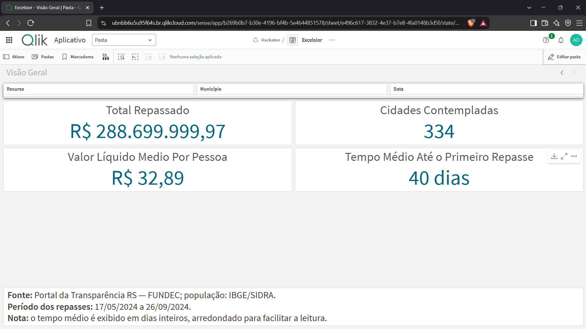
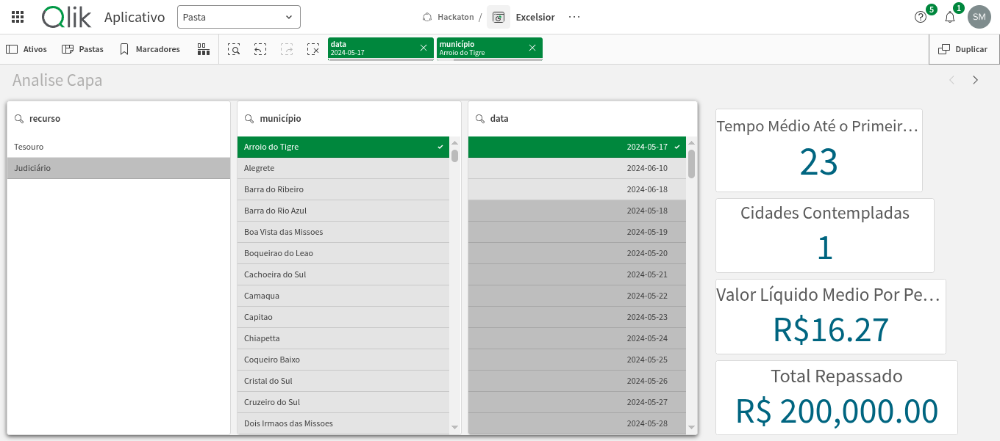
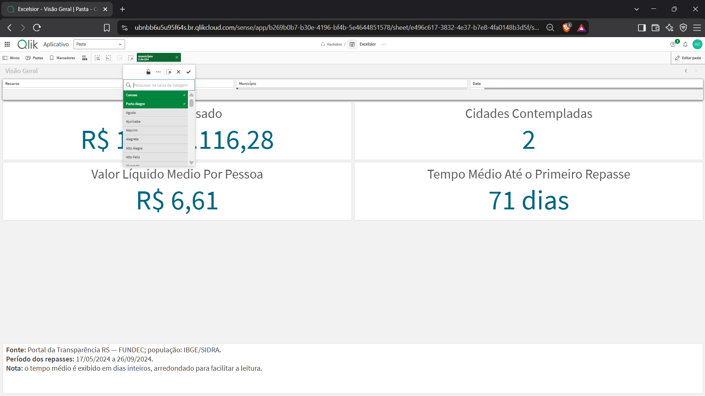

# Task 13 — Capa do App com Filtros e KPIs

## Objetivo

Criar a página inicial ("Visão Geral") do aplicativo Qlik Sense com filtros interativos e 4 KPIs em destaque, conforme solicitado na issue:

- **Total Repassado** — soma líquida de todos os repasses
- **Cidades Contempladas** — quantidade de municípios atendidos
- **Média por Pessoa** — valor líquido dividido pela população
- **Tempo Médio de Espera** — média de dias até o primeiro repasse

## Pré-requisitos

| Task | Descrição | Status |
|---|---|---|
| #10 | Calcular intervalo até o primeiro repasse | ✅ Concluída |
| #12 | Criar cálculos reutilizáveis | ✅ Concluída |

## Medidas Utilizadas

As 4 medidas foram criadas como **itens mestres** no Qlik Sense, conforme definido em [`qlik/medidas-mestras.md`](../qlik/medidas-mestras.md):

| KPI | Expressão Qlik | Valor sem filtros |
|---|---|---|
| **Total Repassado** | `Sum(valor)` | R$ 288.699.999,97 |
| **Cidades Contempladas** | `Count(DISTINCT chave_municipal)` — expressão documentada nesta task | 334 |
| **Média por Pessoa** | `Sum(valor) / Sum(Aggr(Only(populacao_2024), chave_municipal))` | R$ 32,89 |
| **Tempo Médio de Espera** | `Avg({$<status_intervalo={"ok"}>} intervalo_desde_marco_adotado_dias)` | 40,13 dias |

## Filtros Implementados

Três filtros foram adicionados à página inicial para interatividade:

| Filtro | Campo | Origem |
|---|---|---|
| **Município** | `município` | `dim_municipio` |
| **Data** | `data` | `dim_calendario` / `fato_repasses` |
| **Recurso** | `recurso` | `fato_repasses` |

Todos os filtros atualizam os 4 KPIs de forma consistente com as master measures da Task #12.

Antes da correção da Task 16, a expressão observada no app era
`Count(chave_municipal)` e passou a mostrar 831 ao incluir os 497 municípios da
tabela de cobertura. O KPI passou então a usar
`Count(DISTINCT municipio_ibge_2024)` para manter o universo dos 334
municípios com movimentação. A expressão acima é a regra registrada na
documentação original desta task; a configuração atual está em
[`qlik/medidas-mestras.md`](../qlik/medidas-mestras.md).

## Layout da Página

```text
┌──────────────────────────────────────────────────────────┐
│  Visão Geral                                             │
├──────────────────┬──────────────────┬────────────────────┤
│  Recurso         │  Município       │  Data              │
├────────────────────────────┬─────────────────────────────┤
│  Total Repassado           │  Cidades Contempladas      │
├────────────────────────────┼─────────────────────────────┤
│  Valor Médio por Pessoa    │  Tempo Médio de Espera     │
├────────────────────────────┴─────────────────────────────┤
│  Fonte, período analisado e nota de arredondamento       │
└──────────────────────────────────────────────────────────┘
```

## Validação

### Testes Automatizados

A suíte automatizada contém 20 testes:

- 17 testes de integração e validação dos artefatos em
  `tests/test_etl_outputs.py`;
- 3 testes unitários das métricas de repasse em
  `tests/test_metricas_repasses.py`.

Execução:

```powershell
.\.venv\Scripts\python.exe -B -m unittest discover -s tests -p "test_*.py" -v
```

Os 20 testes foram executados com sucesso, confirmando:

- ✅ Valores das medidas mestras sem filtros
- ✅ Seleção conjunta de municípios (Porto Alegre + Canoas)
- ✅ Preservação dos 18 valores negativos
- ✅ Integridade das associações no modelo de dados
- ✅ Script Qlik com sintaxe CSV válida

### Conferência Manual no Qlik Sense

| Cenário | Total Repassado | Cidades | Média Pessoa | Tempo Espera |
|---|---|---|---|---|
| Sem filtros | R$ 288.699.999,97 | 334 | R$ 32,89 | 40,13 dias (exibido como 40) |
| Porto Alegre | R$ 5.782.558,14 | 1 | R$ 4,16 | 84 dias |
| Porto Alegre + Canoas | R$ 11.565.116,28 | 2 | R$ 6,61 | 70,50 dias (exibido como 71) |
| Recurso Judiciário | R$ 179.999.999,97 | 95 | R$ 30,93 | 36,71 dias (exibido como 37) |

O indicador de tempo preserva o cálculo decimal da medida mestra. Apenas sua
apresentação no painel é arredondada para dias inteiros para facilitar a leitura.

## Evidências

As capturas foram adicionadas em `docs/evidencias/task-13/`:

| Arquivo | Descrição | Status |
|---------|-----------|--------|
| `01-capa-geral.png` | Visão geral da página com os 4 KPIs | ✅ Concluído |
| `02-capa-filtros.png` | Recurso Judiciário selecionado, com atualização dos KPIs | ✅ Concluído |
| `03-capa-selecao-multipla.png` | Seleção conjunta de Canoas e Porto Alegre | ✅ Concluído |







### Apresentação validada

As capturas confirmam que os objetos foram ampliados, os valores monetários
foram formatados em `pt-BR`, a unidade `dias` está visível e a página identifica
a fonte e o período analisado. Também registram os cenários com o recurso
Judiciário e com a seleção conjunta de Canoas e Porto Alegre.

## Conclusão

A capa do app foi criada na página inicial do aplicativo Qlik Sense com:

- ✅ 4 KPIs em destaque (total repassado, cidades contempladas, média por pessoa, tempo médio de espera)
- ✅ 3 filtros interativos (município, data, recurso)
- ✅ Medidas consistentes com as master measures da Task #12
- ✅ Indicador de espera incluído (validado na Task #10)
- ✅ Todos os testes automatizados aprovados (20/20)
- ✅ Snapshot do aplicativo exportado com dados
- ✅ Evidências visuais documentadas
- ✅ Fonte, período e regra de arredondamento identificados na página

## Próximas Tasks Desbloqueadas

Com esta task concluída, as seguintes tasks podem ser iniciadas:

- **#19** — Montar Tela 6 (Resumo)
- **#20** — Testar usabilidade do App
- **#21** — Redigir o documento escrito
- **#22** — Gravar o pitch
- **#24** — Auditar o link público

## Estado

Concluída e validada em 15/09/2026. A página inicial do aplicativo Qlik Sense
foi configurada com os quatro KPIs e os três filtros solicitados, fonte e período
identificados, valores formatados em `pt-BR` e evidências dos cenários de
validação.
