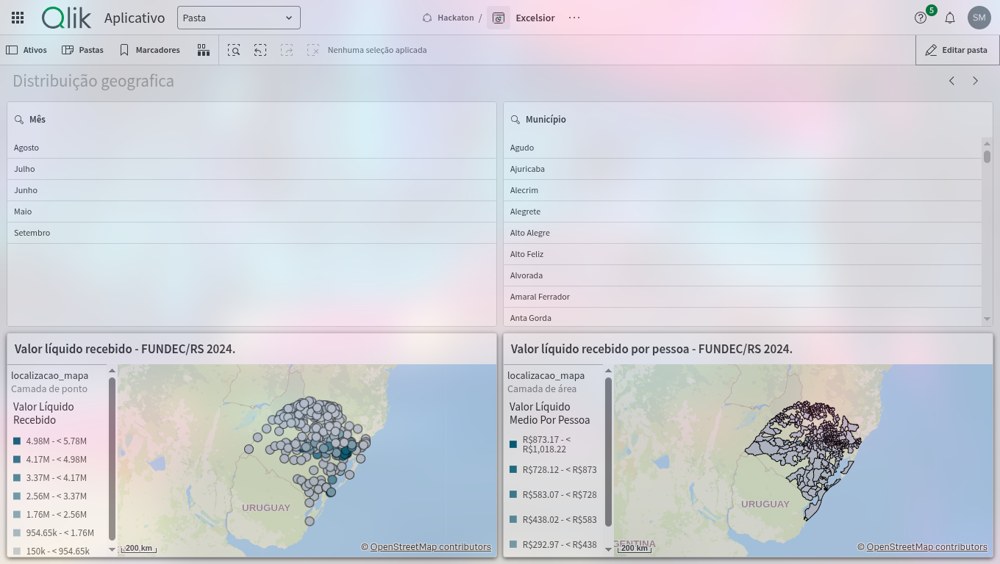
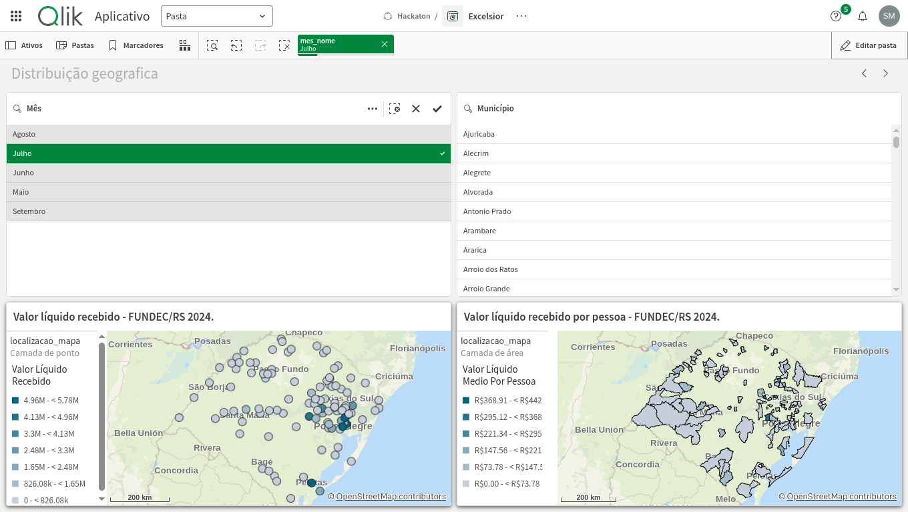
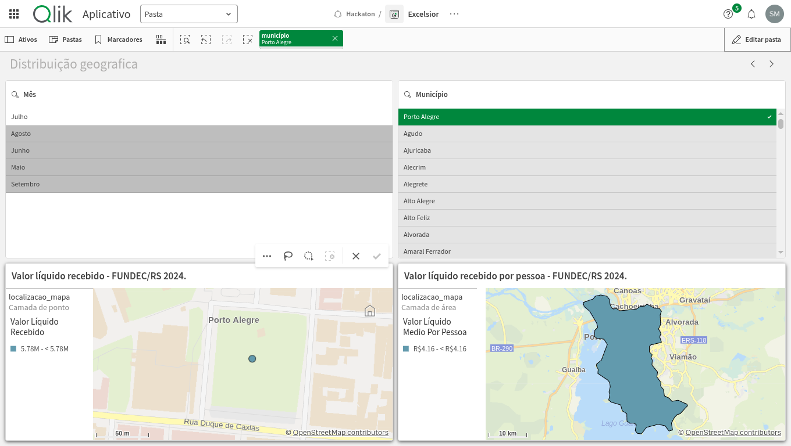

# Task 14 — Tela 1: Distribuição Geográfica

## Objetivo

Construir no Qlik Cloud uma página geográfica do Rio Grande do Sul que permita
comparar, por município recebedor do FUNDEC, o valor líquido recebido e o valor
líquido recebido por pessoa. A comparação por pessoa evita interpretar o valor
total isoladamente como uma medida proporcional ao porte municipal.

## Pré-requisito

A Task #12 definiu e validou as medidas mestras reutilizadas nesta tela. O
protótipo de geocodificação da Task #11 forneceu o campo `localizacao_mapa` e
validou a cobertura dos 334 municípios recebedores.

## Medidas utilizadas

| Indicador | Expressão Qlik | Unidade | Uso na tela |
|-----------|----------------|---------|-------------|
| Valor líquido recebido | `Sum(valor)` | R$ | Mapa de pontos |
| Valor líquido recebido por pessoa | `If(Sum(Aggr(Only(populacao_2024), chave_municipal)) > 0, Sum(valor) / Sum(Aggr(Only(populacao_2024), chave_municipal)))` | R$/pessoa | Mapa de áreas |

As expressões e regras completas estão em
[`qlik/medidas-mestras.md`](../qlik/medidas-mestras.md). O valor líquido
preserva créditos e ajustes negativos; o denominador do indicador por pessoa é
a população estimada pelo IBGE/SIDRA para 2024, agregada uma vez por município.

## Configuração da página

### Mapas

- **Valor líquido recebido — FUNDEC/RS 2024:** camada de pontos com
  `localizacao_mapa` e cor por valor líquido recebido. A legenda usa R$ e
  permite localizar os valores totais municipais.
- **Valor líquido recebido por pessoa — FUNDEC/RS 2024:** camada de área com
  `localizacao_mapa` e cor por valor líquido recebido por pessoa. O título
  explicita que os valores em R$ representam R$/pessoa.

As duas camadas usam a mesma identificação geográfica municipal. A inspeção
visual confirma que os pontos e as áreas estão no Rio Grande do Sul. A
validação do ETL registrada na Task #11 confirmou 334/334 localizações
municipais distintas, sem população ausente ou não positiva entre os
recebedores.

### Filtros e tooltips

| Elemento | Campo ou comportamento |
|----------|------------------------|
| Mês | `mes_nome` |
| Município | `município` |
| Tooltip de pontos | Localização e valor líquido recebido da camada de pontos. |
| Tooltip de áreas | Localização e valor líquido recebido por pessoa da camada de áreas. |

Os filtros atuam sobre ambos os mapas por meio do modelo associativo do Qlik.

## Validação

| Cenário | Resultado comprovado |
|---------|----------------------|
| Sem seleções | Os dois mapas exibem municípios do RS, com legendas distintas para valor total e valor por pessoa. |
| Filtro de mês | A seleção de julho altera simultaneamente as duas camadas. |
| Filtro de município | A seleção de Porto Alegre isola o ponto e a área municipal; o mapa mostra R$ 5,78 milhões no valor total e R$ 4,16 por pessoa. |
| Tooltip de pontos | Exibe municípios e respectivos valores líquidos recebidos. |
| Tooltip de áreas | Exibe municípios e respectivos valores líquidos por pessoa. |

As evidências estão em `docs/evidencias/task-14/`:

1. `01-distribuicao-geografica-geral.png`
2. `02-distribuicao-geografica-filtro-mes.png`
3. `03-distribuicao-geografica-filtro-municipio.png`
4. `04-tooltip-valor-total.png`
5. `05-tooltip-valor-por-pessoa.png`

## Limitações

- A tela compara valores recebidos e população; ela não mede diretamente a
  intensidade do impacto, a necessidade de recursos ou a adequação do repasse.
- Sem uma fonte municipal de impacto, não é possível concluir apenas pelos
  mapas se municípios pequenos receberam proporcionalmente menos.
- A interpretação dos limites municipais depende da resolução geográfica do
  Qlik para `localizacao_mapa`; qualquer ausência de associação deve ser
  investigada no campo de origem antes de interpretar o mapa.

## Snapshot

O aplicativo foi exportado com dados em
[`qlik/versoes-do-app/06-task-14/app.qvf`](../qlik/versoes-do-app/06-task-14/app.qvf).
Os metadados de tamanho e SHA-256 estão no
[`README do snapshot`](../qlik/versoes-do-app/06-task-14/README.md).

## Estado

Concluída e validada em 16/09/2026.
