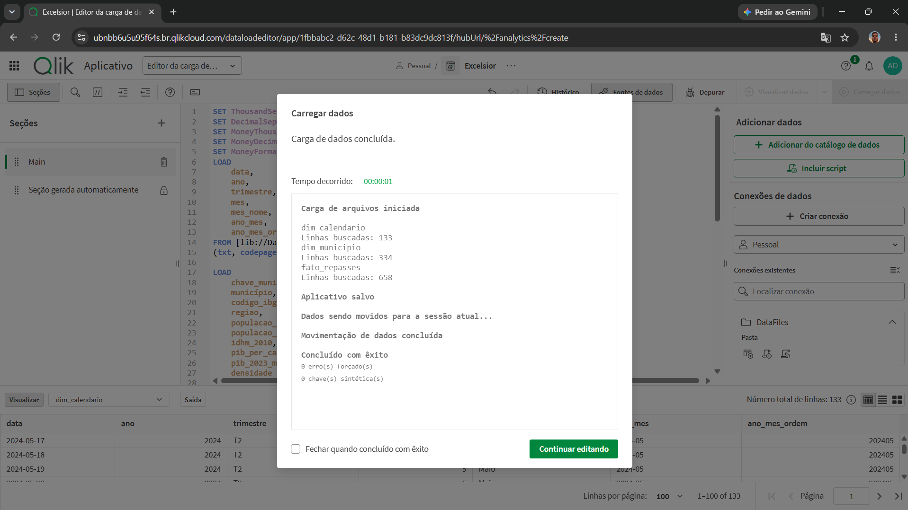
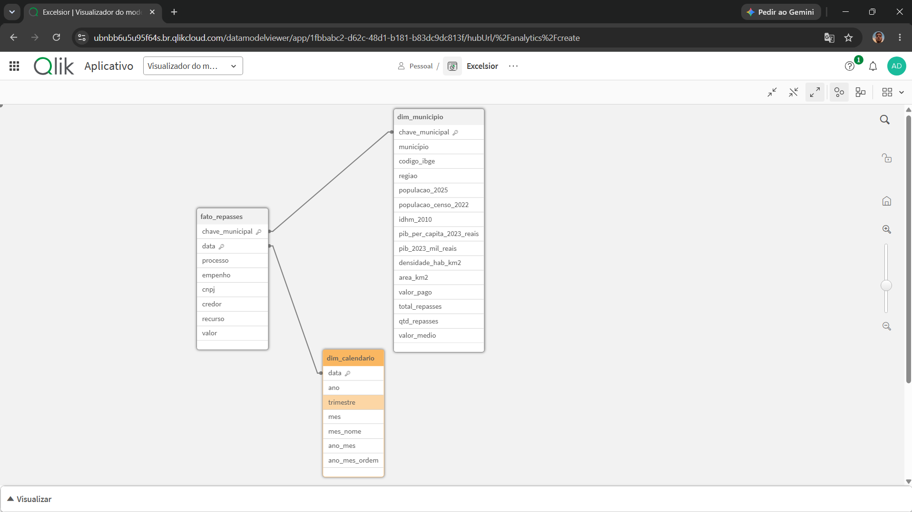
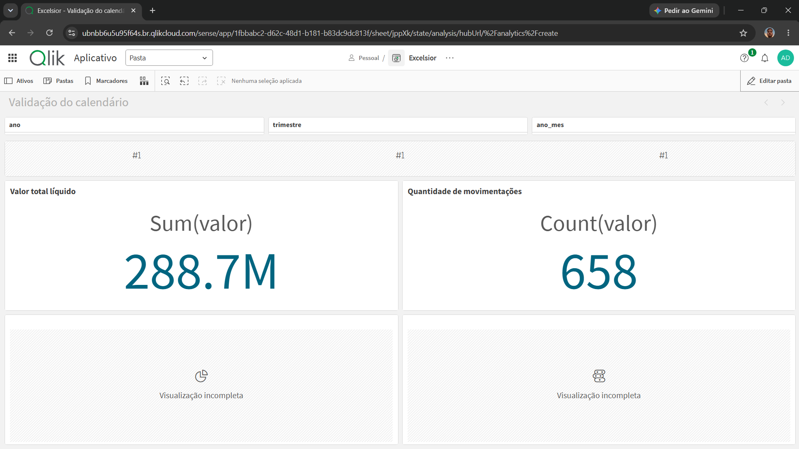
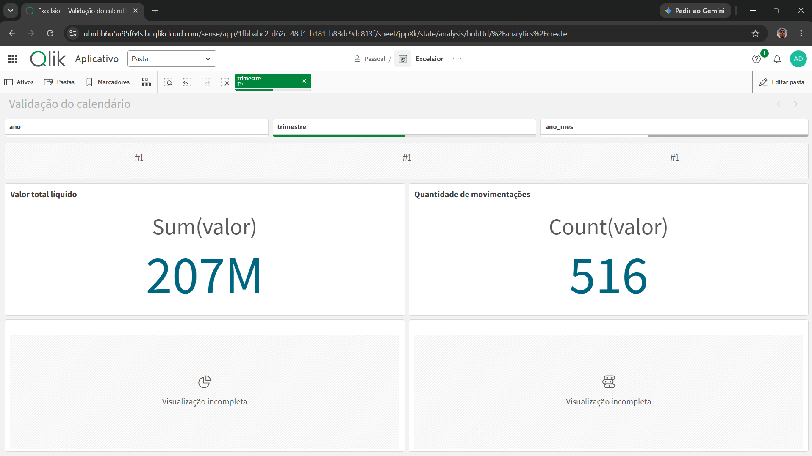

# Task 9 — Validação do calendário

## Objetivo

Disponibilizar uma dimensão calendário associada às datas dos repasses para permitir filtros por ano, trimestre e mês no Qlik Sense.

## Implementação

A dimensão `dim_calendario` possui uma linha por dia entre a primeira e a última movimentação:

- Data inicial: 17/05/2024
- Data final: 26/09/2024
- Quantidade de datas: 133
- Frequência: diária, sem lacunas
- Chave de associação: `data`

Campos disponíveis:

- `data`
- `ano`
- `trimestre`
- `mes`
- `mes_nome`
- `ano_mes`
- `ano_mes_ordem`

## Modelo de dados

O modelo foi carregado com as seguintes associações:

- `dim_municipio` → `fato_repasses` por `chave_municipal`
- `dim_calendario` → `fato_repasses` por `data`

Não foram encontradas chaves sintéticas ou associações circulares.

## Validação dos filtros

### Sem filtros

- Movimentações: 658
- Valor total líquido: R$ 288.699.999,97

### Segundo trimestre — T2

- Movimentações: 516
- Valor total líquido: R$ 206.955.813,93

### Terceiro trimestre — T3

- Movimentações: 142
- Valor total líquido: R$ 81.744.186,04

Após limpar os filtros, os valores totais retornaram aos números originais. Isso confirma que os filtros de período não duplicam movimentações.

## Testes automatizados

Foram executados 12 testes automatizados, incluindo:

- continuidade diária do calendário;
- ausência de datas duplicadas;
- cobertura de todas as datas da fato;
- conferência de ano, trimestre, mês e ano-mês;
- integridade das associações do modelo.

Resultado: `OK`.

## Evidências

### Recarga concluída

### Modelo de dados

### Validação sem filtros

### Filtro do segundo trimestre

