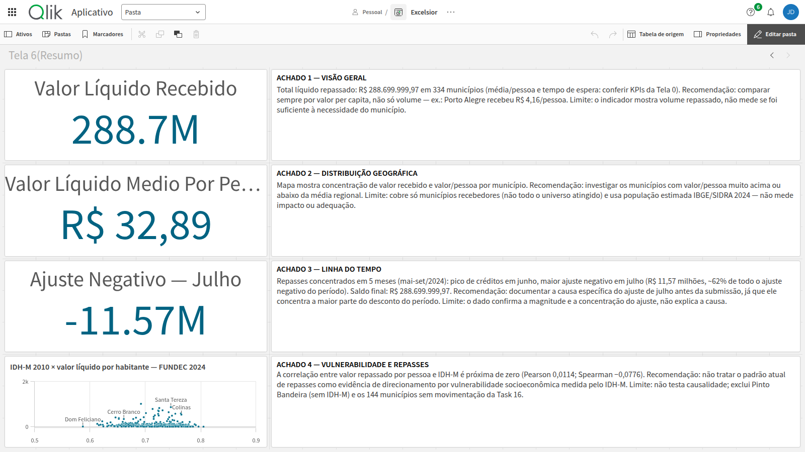

# Snapshot 11 — Task 19

Aplicativo Qlik com a **Tela 6 — Resumo**. É o sucessor do
[snapshot 10](../10-task-18/README.md).

## Arquivo e evidências

- Arquivo: [`app.qvf`](./app.qvf).
- Exportação informada pelo usuário: **18/09/2026**, na plataforma Qlik,
  com a opção **com dados**. Responsável: **John** (`JohnVictor777`),
  autor da entrega no PR.
- Tamanho verificado: **655.360 bytes**.
- SHA-256 verificado: `2864377BABD75CC681690DEC6D83A4DC4BDED80C87277EDE03D7CEED5D585BBF`.
- Armazenamento: Git LFS, pela regra `*.qvf` em `.gitattributes`.
- Capturas: [Telas 0 a 6](../../../docs/screenshots/tela-6-resumo/).

As capturas mostram o aplicativo original antes da exportação. Em
**18/09/2026**, o usuário confirmou que já reimportou este QVF. A restauração
foi, portanto, conferida pelo usuário; não há uma captura separada do
aplicativo reimportado nem verificação independente de cada objeto.

## Restauração

Faça upload de `app.qvf` no Qlik Cloud como um novo aplicativo. Com as
seleções limpas, confira as sete telas, os quatro achados da Tela 6 e se os
dados aparecem sem recarga. Para recarregar, disponibilize os cinco CSVs de
`data/processed/` na conexão `DataFiles` e ajuste o caminho da conexão ao
espaço de destino, conforme
as [instruções do snapshot 10](../10-task-18/README.md#restauração).

## Tela 6 — Resumo

**Achado 1 — Visão geral:** total líquido repassado de R$ 288.699.999,97
em 334 municípios (média/pessoa e tempo de espera: conferir KPIs da
Tela 0). Recomendação: comparar sempre por valor per capita, não só
volume — ex.: Porto Alegre recebeu R$ 4,16/pessoa. Limite: o indicador
mostra volume repassado, não mede se foi suficiente à necessidade do
município.

**Achado 2 — Distribuição geográfica:** mapa mostra concentração de
valor recebido e valor/pessoa por município. Recomendação: investigar
os municípios com valor/pessoa muito acima ou abaixo da média
regional. Limite: cobre só municípios recebedores (não todo o
universo atingido) e usa população estimada IBGE/SIDRA 2024 — não
mede impacto ou adequação.

**Achado 3 — Linha do tempo:** repasses concentrados em 5 meses
(mai-set/2024): pico de créditos em junho, maior ajuste negativo em
julho (R$ 11,57 milhões, ~62% de todo o ajuste negativo do período).
Saldo final: R$ 288.699.999,97. Recomendação: documentar a causa
específica do ajuste de julho antes da submissão, já que ele
concentra a maior parte do desconto do período. Limite: o dado
confirma a magnitude e a concentração do ajuste, não explica a causa.

**Achado 4 — Vulnerabilidade e repasses:** a correlação entre valor
repassado por pessoa e IDH-M é próxima de zero (Pearson 0,0114;
Spearman −0,0776). Recomendação: não tratar o padrão atual de
repasses como evidência de direcionamento por vulnerabilidade
socioeconômica medida pelo IDH-M. Limite: não testa causalidade;
exclui Pinto Bandeira (sem IDH-M) e os 144 municípios sem
movimentação da Task 16.

**Critérios de conclusão atendidos (issue #19):**
- [x] Cada achado tem uma visualização ou cálculo verificável associado
- [x] Recomendações decorrem dos resultados e explicitam limites
- [x] Apenas análises executadas e validadas foram incluídas
